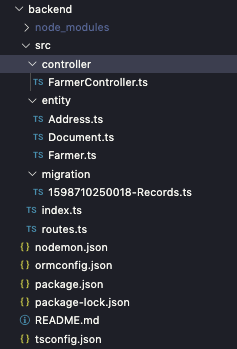

# typeorm-with-angular - Back-End

This is a API NodeJS using TypeORM with PostgreSQL

### Mains Steps

Steps to run this project:

1. Run `npm i` command
2. Setup database settings inside `ormconfig.json` file
3. Run `npm start` command

### Structure Image and Main Archives

- ormconfig.json to set your database config.
- src/index.ts is where there are setting of server and init express for example, there are important configurations that for example CORS to frontend.
- src/routes.ts to set endpoints of API.
- src/controller/ where is the method to research in PostgreSQL.
- src/entity/ map of entit, it's used to create your tables anda relations.
- src/migrations/ settings of database and seed.
- package.json there is custom commands