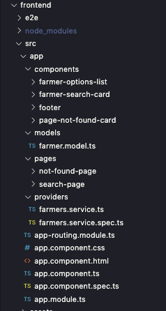

# typeorm-with-angular - Back-End

This is a client side of application

### Mains Steps

Steps to run this project:

1. Run `npm i` command
2. ng serve

### Structure Image and Main Archives

- /src/app/components/ there is components for use in your pages.
- /src/app/models/ is where thare are interfaces of data.
- /src/app/page/s... pages of application.
- /src/app/providers/ there is a provider to get data os server side... I not created a .env to base api url per signal.
